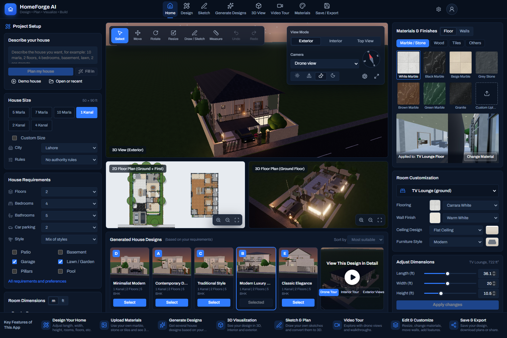
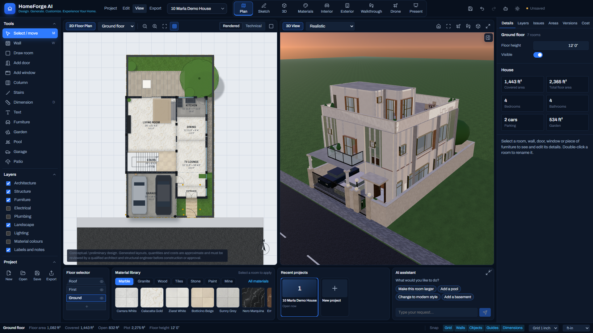
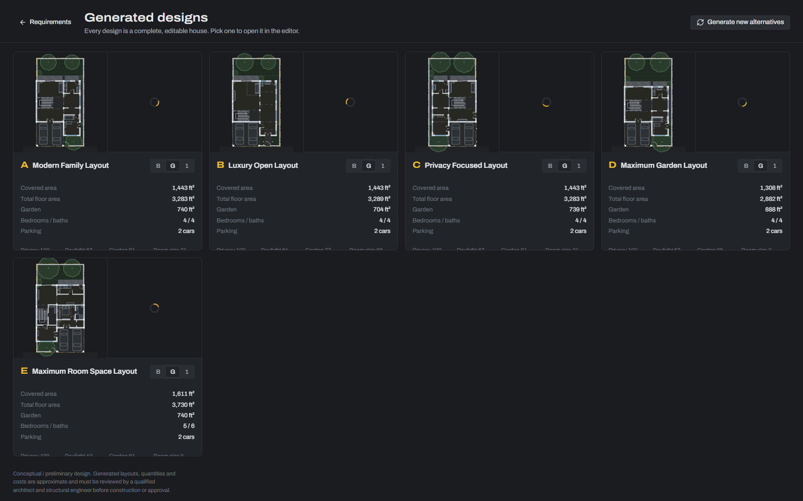
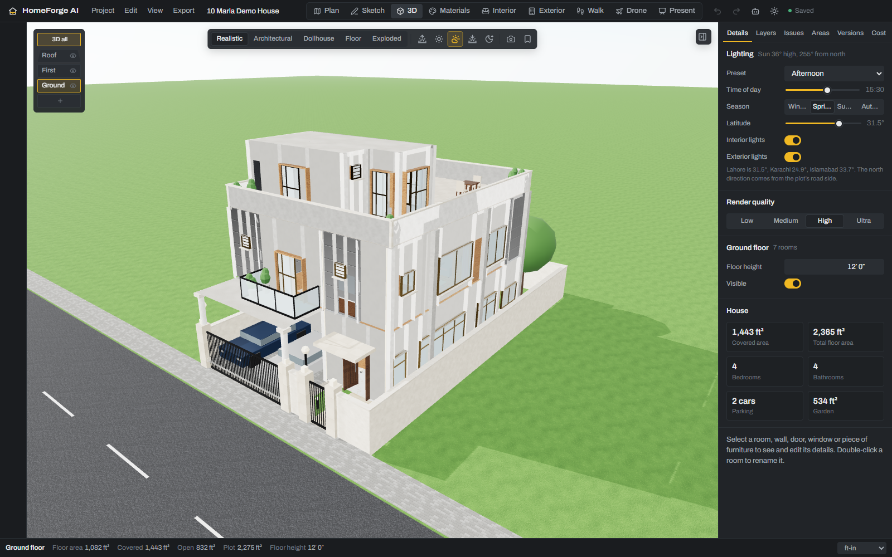
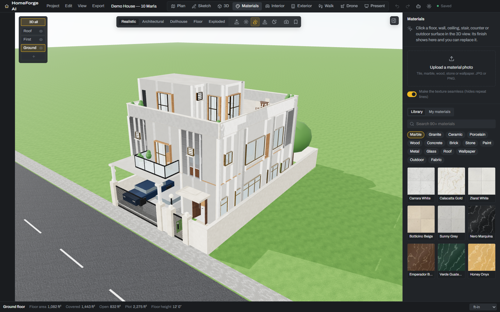
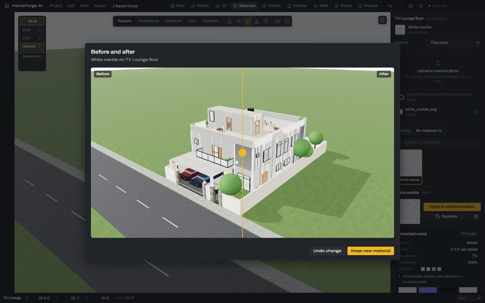
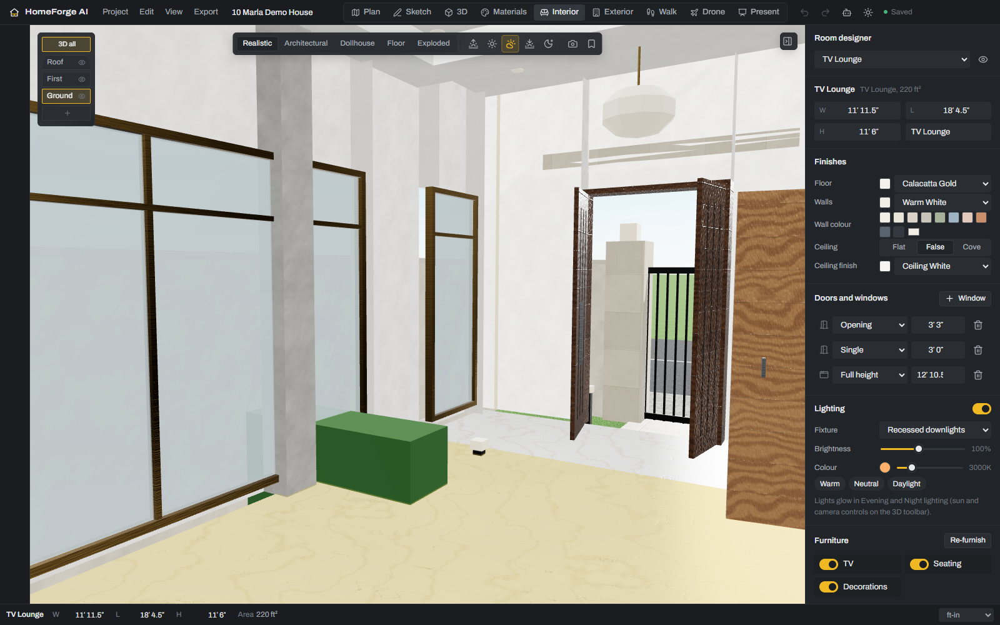
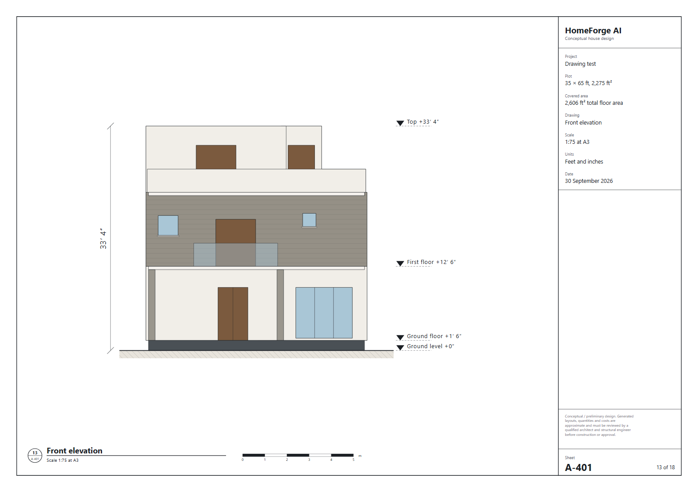

# HomeForge AI

**Design. Generate. Customize. Experience Your Home.**

A Windows desktop app for planning a house on a Pakistani plot (marla/kanal or custom). Describe what you need, get five complete designs, then edit the plan, walk through the house in 3D, try real materials from a photo, and export drawings, images, a 3D model and a presentation.

Everything comes from one structured house model. The 2D plan, 3D view, elevations, sections, walkthrough, drone flight, estimates and every export are generated from it, so they always agree.

> Conceptual / preliminary design. Generated layouts, quantities and costs are approximate and must be reviewed by a qualified architect and structural engineer before construction or approval.



The home screen is a design dashboard: set the plot and requirements on the left, generate five designs, and see the chosen house live in 3D with its rendered floor plans and a 3D cut-away. Try finishes on any room with a preview, adjust its size, play a drone tour, or jump into any tool. Additions to the original spec are listed in [docs/AMENDMENTS.md](docs/AMENDMENTS.md).

The workspace puts the 2D plan and the 3D view side by side, with tools, layers, floors, materials, recent projects and the assistant one click away.



## What it does

| Area | Highlights |
|---|---|
| Requirements | Plot presets (3–15 marla, 1/2/4 kanal), custom and irregular plots, 7-step wizard, or plain text: "10 marla double-storey, 4 bedrooms, basement, large lawn…" |
| Designs | Five strategies (family, luxury open, privacy, garden, room space) with walls, doors, windows, stairs, columns, parking, garden and furniture; scores, "Why this design?", alternatives, side-by-side comparison, validation |
| 2D editor | 14 tools, snapping, parametric resize that keeps neighbours connected, split/merge, layers, grid, beginner and advanced modes, undo/redo |
| 3D | Realistic, architectural, dollhouse, floor and exploded views; sun by time, season and latitude; night lighting; cameras and bookmarks; WASD walkthrough with collisions; drone flythrough with video recording |
| Materials | 90+ procedural PBR materials; upload a photo and the app detects the material, pattern, scale, roughness and reflectivity, builds seamless normal/roughness/height maps, asks before applying, and shows a before/after slider |
| Rooms and exterior | Room designer (finishes, colour, ceiling, lighting, furniture, curtains, garage, garden), facade editor with live elevations, text requests that change the real model |
| Sketch and images | Freehand sketch (mouse, pen, touch) or a photo of a plan becomes an editable floor plan; extra rooms can be sketched onto an existing plan |
| Assistant | "Make the master bedroom 2 feet wider", "Add a bathroom beside bedroom 3", "Add a swimming pool", "Change the exterior to stone". Works offline; optional Claude integration |
| Output | A3 drawing sets (plans, dimension, furniture, electrical, lighting, site, roof, elevations, sections) as PDF/SVG/PNG/JPG/DXF; GLB/glTF/OBJ; renders; walkthrough video; presentation PDF; `.homeforge` project file |
| Costs | Construction estimate and material quantities with Pakistan, UAE, UK, USA or custom rates |
| Pakistan-ready | City and Qibla direction (WCs seated side-on to it), LDA and DHA Lahore building rules with designs generated to comply, rooftop solar planner with payback, grey-structure and finishing costs |
| Photoreal | Path-traced stills of any 3D view up to 4K, in materials or clay; needs the OpenGL graphics backend on Windows (Settings → Graphics) |

| | |
|---|---|
|  |  |
|  |  |
|  |  |

## Run it

Requires Node.js 20+ on Windows.

```bash
npm install
npm run dev        # desktop app with hot reload
npm run build      # production build
npm run start      # run the production build
npm run dist       # Windows installer in release/
```

`npm run web` serves the same app in a browser at http://localhost:5199 (used for UI tests).

### Optional: Claude

The built-in assistant and description parser work offline. To use Claude for free-form requests, add an Anthropic API key in **Project → Project settings → Assistant**. The key is stored encrypted by the operating system and only the main process sends requests (model `claude-opus-5-5`, structured JSON output).

## Tests

```bash
npm test                          # unit tests: walls, generator, parser, editing, recognition, drawings
python e2e/tour.py                # screenshots of every mode (needs `npm run web`)
python e2e/wizard.py              # wizard → five designs → editor → export
python e2e/final_scenario.py      # the full §72 scenario, end to end
```

The Python scripts use Playwright (`pip install playwright && playwright install chromium`).

## Project layout

```
src/main        Electron main process: windows, files, autosave, settings, Claude calls
src/preload     Safe bridge between the page and the main process
src/shared      Types and AI schemas shared by both sides
src/renderer/src
  core/         House model, units, geometry, room rules, material library, furniture catalog
  planner/      Generator, walls, stairs, furnishing, validation, access, estimates, edits
  editor/       2D CAD editor
  engine/       Three.js engine, builders, materials, walkthrough and drone controllers
  render/       Drawing backends (canvas, SVG) and plan/house images
  export/       Sheets, elevations, sections, PDF/DXF backends, 3D model export
  ai/           Requirement parser, natural-language editor, assistant, material analysis, sketch recognition
  modes/        Materials, room designer, exterior, sketch, walk, drone, presentation
  workspace/    Title bar, toolbar, floor stack, inspector, status bar
  storage/      Project file format, autosave, platform bridge
docs/           Spec, requirements checklist, design system
```

Requirement status, section by section: [docs/REQUIREMENTS_CHECKLIST.md](docs/REQUIREMENTS_CHECKLIST.md).
